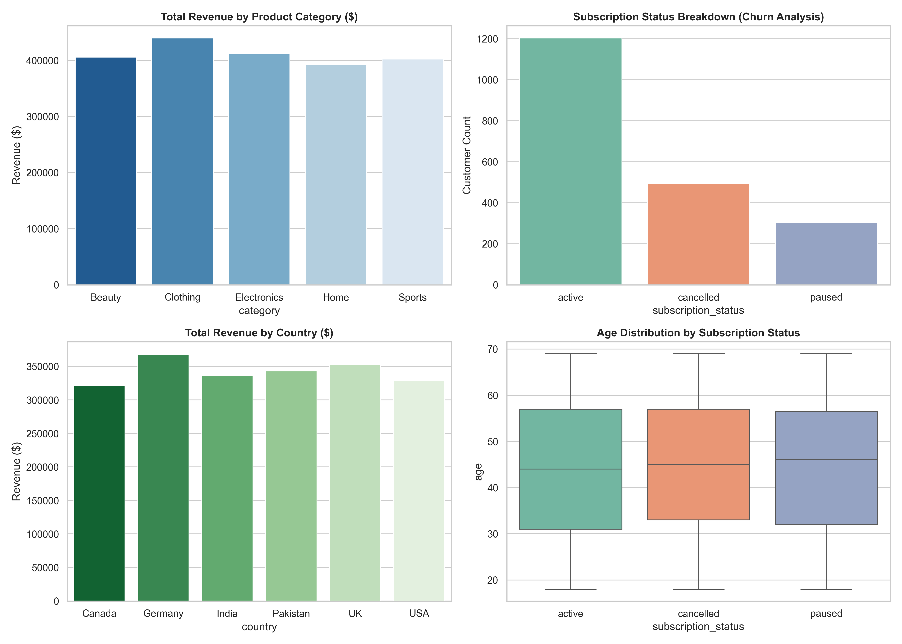

# 📊 Global E-Commerce Customer Insights & Churn Risk Analytics

An end-to-end data analytics project examining 2,000 e-commerce transaction records across 6 global markets. This project combines **Excel**, **SQL**, and **Python** to perform data cleaning, feature engineering, relational database querying, and automated dashboard visualization.

---

## 📸 Executive Analytics Dashboard



---

## 🎯 Key Business Highlights & Insights

* **Total Revenue Generated:** **$2,051,690.65** across 2,000 orders.
* **Top Revenue Categories:**
  1. **Clothing:** $437,341.34
  2. **Electronics:** $411,363.31
* **Geographic Market Analysis:**
  * **Top Market by Revenue:** **Germany** ($366,134.90) and **UK** ($351,691.03).
  * **Highest Churn Risk:** **India** with a **29.32%** subscription cancellation rate.
  * **Lowest Churn Risk:** **UK** with a **20.00%** cancellation rate.
* **Subscription Breakdown:**
  * **Active:** 1,204 customers (60.20%)
  * **Cancelled (Churned):** 493 customers (24.65%)
  * **Paused:** 303 customers (15.15%)

---

## 🛠️ Tool Stack & Methodology

| Tool | Purpose | Key Operations |
| :--- | :--- | :--- |
| **Excel** | Data Transformation & Feature Engineering | `unit_price * quantity` calculation, `churn_flag` categorization, and customer loyalty segmentation. |
| **SQL (MySQL / SQLite)** | Relational Database Queries | Data aggregation using `GROUP BY`, conditional aggregations (`CASE WHEN`), and revenue rankings. |
| **Python (Pandas, Seaborn, Matplotlib)** | Automation & Visual Reporting | Data loading, KPI calculations, dynamic chart rendering, and dashboard image export. |

---

## 📁 Repository Structure

```text
├── data/
│   └── E Commerce Customer Insights and Churn Dataset.csv
├── queries/
│   └── analysis_queries.sql
├── dashboard/
│   └── ecommerce_insights_dashboard.png
├── ecommerce_analytics.py
└── README.md
